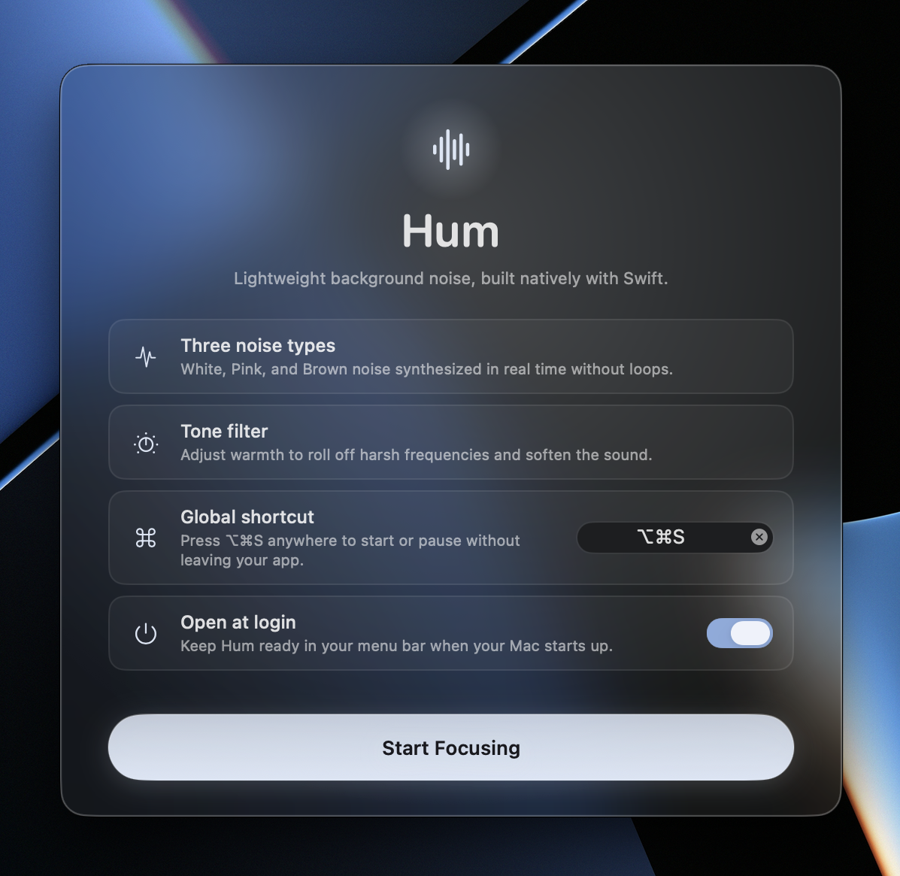
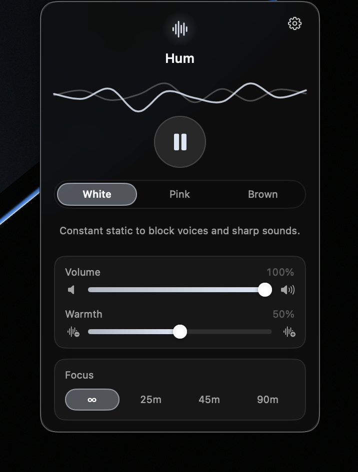
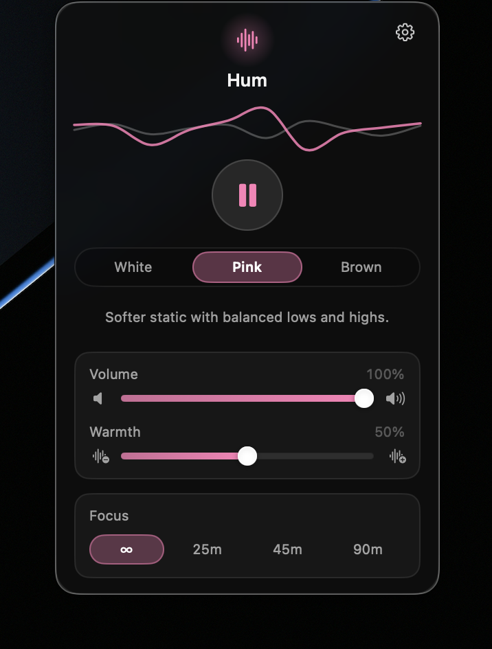
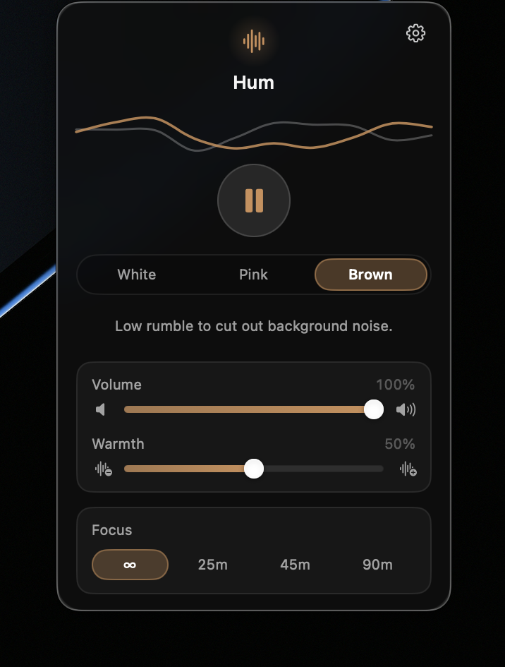
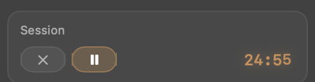

<div align="center">

# Hum

**Native Swift • Procedural synthesis • Zero loops**

[**↓ Download for macOS**](https://github.com/filippocappa/hum/releases/latest) · macOS 14+ · ~1.6 MB



<table>
<tr>
<td></td>
<td></td>
<td></td>
</tr>
<tr>
<td align="center"><b>White</b></td>
<td align="center"><b>Pink</b></td>
<td align="center"><b>Brown</b></td>
</tr>
</table>



*Start a focus session and the duration pills morph into a live countdown,
with stop and play/pause alongside.*

</div>

## What it is

A menu bar app that generates noise. There are no audio files in this
repository and nothing loops, because there is nothing to loop — every sample is
computed on the CoreAudio render thread as it is needed, from the mathematics of
the noise itself.

- **100 % native Swift** — SwiftUI and AVFoundation, no web view, no wrapper.
  One dependency, [KeyboardShortcuts](https://github.com/sindresorhus/KeyboardShortcuts).
- **Live synthesis, no samples** — nothing to loop, so nothing to notice looping.
- **Under 1 % CPU** while playing, 0.0 % idle.
- **⌥⌘S from anywhere** — a Carbon hotkey, so **no Accessibility permission**.
- **Menu bar only** — `LSUIElement`, no Dock icon, no windows.

## Noise profiles

| Profile | Sound | Synthesis |
|---|---|---|
| **White** | Constant static to block voices and sharp sounds | Uniform distribution, flat spectrum |
| **Pink** | Softer static with balanced lows and highs | Paul Kellet 3-pole 1/f approximation |
| **Brown** | Low rumble to cut out background noise | Leaky integrator → Butterworth biquad, ~5 Hz DC blocking |

Plus a **warmth** filter sweeping 190 Hz – 950 Hz, a focus timer (∞ / 25 / 45 /
90 minutes), and a waveform that reacts to the engine's live gain.

Volume, warmth and the selected profile persist across launches. A fresh install
starts at volume 100 %, warmth 50 % and White — warmth sits mid-range so Deep
Brown keeps its subterranean character out of the box.

## Performance

Measured with `top`, release build:

| State | CPU |
|---|---|
| Idle, popover closed | 0.0 % |
| Playing, popover closed | 0.4–0.8 % |
| Playing + continuous slider drag | 1.6 % |

Three things keep it there. Nothing allocates or locks on the render thread —
white noise comes from an inlined xorshift32 generator rather than
`Float.random`, which takes a lock on a global generator and can stall the
callback into a dropout. The high-frequency visual signal lives on its own
observable, so a 30 Hz gain update cannot invalidate the menu bar label and
trigger a status-item re-render. And the scene never observes the audio
controller, so a volume drag does not re-evaluate it.

## Install

Download the latest [release](https://github.com/filippocappa/hum/releases),
unzip, and move `Hum.app` to `/Applications`. It is ad-hoc signed, so the first
launch needs **right-click → Open**.

Or build it:

```bash
git clone https://github.com/filippocappa/hum.git
cd hum
swift run          # straight into the menu bar
./bundle.sh        # or: a signed Hum.app with its icon
```

Requires macOS 14.0+ and Swift 5.9+.

## Architecture

```
Sources/Hum/
  HumApp.swift                       MenuBarExtra(.window) entry point, agent policy
  Audio/NoiseDSP.swift               lock-free, allocation-free render-thread DSP
  Audio/AudioEngineController.swift  engine graph, focus timer, sleep/wake
  Audio/VisualizerState.swift        high-frequency visual signal, kept off the controller
  Audio/MenuBarState.swift           isPlaying alone, so the label redraws rarely
  Audio/Shortcuts.swift              ⌥⌘S definition
  Audio/LoginItem.swift              SMAppService launch-at-login
  UI/PopoverView.swift               280 pt popover
  UI/WaveformView.swift              Béziered ribbon driven by the live gain scalar
  UI/SplashView.swift                first-run splash, staged entrance
  UI/Controls.swift                  pills, sliders, chips, pulsing mark
Tools/
  measure.swift                      offline RMS / peak calibration harness
  make-icon.swift                    CoreGraphics app icon renderer
```

Every parameter is interpolated per sample — gain, cutoff, and the switch
between profiles. Measured, no transition exceeds the signal's own steady-state
sample delta, so there is nothing to click.

## Calibration

`Tools/measure.swift` renders each profile offline and reports its level at the
shipped defaults — volume 100 %, warmth 50 %:

```
brown  rms 0.1245 (-18.1 dBFS)   peak 0.529 (-5.5 dBFS)
pink   rms 0.1054 (-19.5 dBFS)   peak 0.435 (-7.2 dBFS)
white  rms 0.0889 (-21.0 dBFS)   peak 0.165 (-15.6 dBFS)
```

The targets are deliberately not equal RMS: at matched RMS the low-biased brown
spectrum reads quieter and flat white reads harsher, so brown sits ~3 dB hot and
white ~1.5 dB cool. Peaks stay clear of full scale at maximum volume.

## License

MIT
